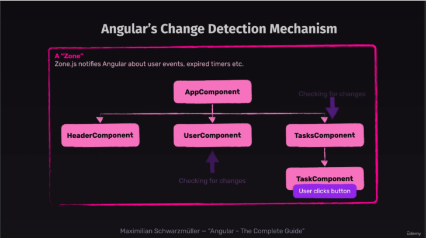

# Section 2 : Angular essentials components, templates, services & more

- [Udemy](https://www.udemy.com/course/the-complete-guide-to-angular-2/learn/lecture/43788534#overview)
- [angular - documentation - zone](https://angular.dev/best-practices/zone-pollution)
- [angular - schema - zone](images/angular-zone.png)

## **27. A Look Behind the Scenes of Angular's Change Detection Mechanism**

- **Purpose**: Understand how Angular’s **change detection** mechanism ensures that the DOM stays in sync with the component state.

---

### Key Concepts

1. **What is Change Detection?**:

   - Change detection is Angular’s way of ensuring that updates in the component’s state (variables or properties) are reflected in the DOM.
   - Angular automatically runs change detection after certain events, such as:
     - User interactions (e.g., clicks, keypresses).
     - Timer events (e.g., `setTimeout`, `setInterval`).
     - HTTP responses.

2. **How Change Detection Works**:

   - Angular checks the **component tree** for updates.
   - It compares the current state of variables with their previous state to detect changes.
   - If a change is detected, Angular updates the DOM accordingly.

3. **Zones in Angular**:
   - Angular uses **zones** (via Zone.js) to intercept asynchronous tasks and trigger change detection when they complete.
   - Examples of asynchronous tasks:
     - HTTP requests.
     - Timers (`setTimeout`, `setInterval`).
     - User events (e.g., `click`, `input`).

<div style="text-align:center">

</div>
---

### Exploring Change Detection in Action

1. **Add a Dynamic Timer to the Component Class** (`user.component.ts`):

   - Update the component with a timer to demonstrate change detection:

     ```typescript
     import { Component, OnInit } from "@angular/core";

     @Component({
       selector: "app-user",
       templateUrl: "./user.component.html",
       styleUrls: ["./user.component.css"],
     })
     export class UserComponent implements OnInit {
       currentTime: string = "";

       ngOnInit(): void {
         setInterval(() => {
           this.currentTime = new Date().toLocaleTimeString();
         }, 1000);
       }
     }
     ```

2. **Display the Timer in the Template** (`user.component.html`):

   - Use string interpolation to show the updated time:

     ```html
     <div class="timer">
       <p>Current Time: {{ currentTime }}</p>
     </div>
     ```

3. **Style the Timer** (`user.component.css`):

   - Add simple styling for the timer display:

     ```css
     .timer {
       text-align: center;
       font-size: 1.5rem;
       color: #4caf50;
       margin-bottom: 1rem;
     }
     ```

4. **Test Change Detection**:

   - Start the development server:

     ```bash
     ng serve
     ```

   - Open `http://localhost:4200` and observe the timer updating every second.

---

### Key Takeaways

1. **Automatic Updates**:

   - Angular’s change detection automatically updates the DOM when component state changes, as seen with the timer.

2. **Efficient Mechanism**:

   - Change detection only updates the parts of the DOM affected by changes, ensuring efficiency.

3. **Triggered by Events**:
   - Angular’s change detection is triggered by user interactions, asynchronous operations, and framework events.

---

### Example Scenarios

1. **User Interaction**:

   - Clicking a button updates the DOM due to change detection.

2. **HTTP Requests**:

   - After receiving a response, Angular updates the relevant parts of the DOM.

3. **Timers and Animations**:
   - Periodic updates (e.g., a clock) are automatically reflected in the DOM.
